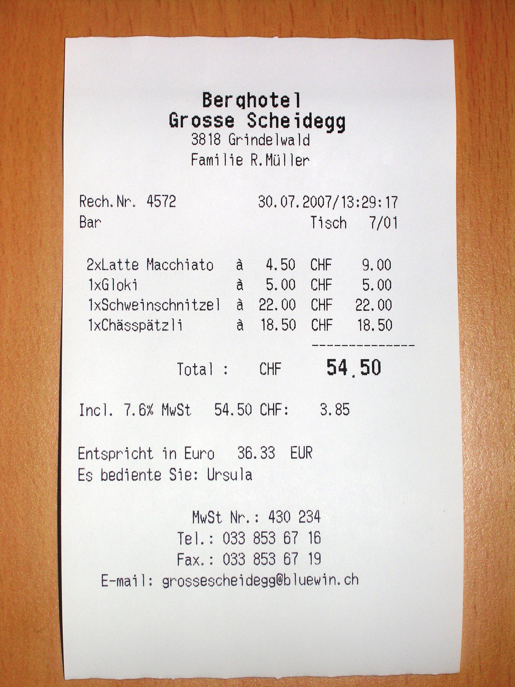
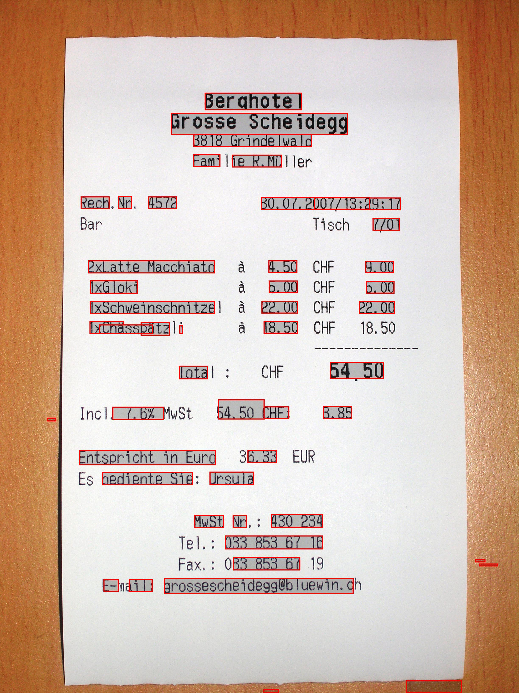

# swt

```python
from PIL import Image
from swt.swt import swt

img = IMage.open('sample/ReceiptSwiss.jpg')
for x0,y0, x1,y1 in swt(img):
    print(x0,y0, x1,y1)
```

See also `sample/sample.py`

## Building

(so far build was tested on MacOS only)

```
mkdir build
cd build; cmake ..; make; cd ..
```

## Running sample
```
python3.7 -m venv .venv
. .venv/bin/activate
pip install -r requirements.txt

PYTHONPATH=. python samples/sample.py \
    samples/ReceiptSwiss.jpg \
    samples/ReceiptSwiss-out.jpg
```

Input:


Output:

